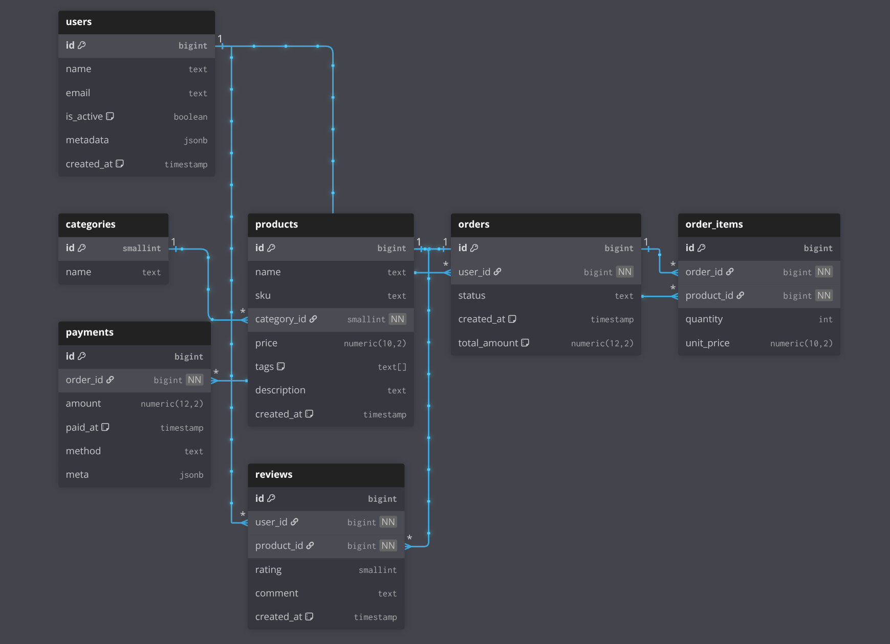

# PostgreSQL playground

A containerized PostgreSQL instance pre-loaded with a generated data for SQL training and query practice. Provides a instant, consistent environment for learning and testing.

## Tables



## Commands

Start database:

```sh
docker compose up -d
```

Connect to database:

```sh
docker exec -it postgres_playground psql -U postgres -d database
```

> Type `quit` to exit

Perform SQL query from host machine:

```sh
docker exec \
    -it postgres_playground psql \
    -U postgres \
    -d database \
    -c "SELECT * FROM users LIMIT 10;"
```

Stop database:

```sh
docker compose down
```

Stop database and delete all data:

```sh
docker compose down -v
```

## Examples

1. Select names of inactive users:

```sql
SELECT name FROM users WHERE is_active = False;
```

2. Select products with prices more than 90:

```sql
SELECT name, price FROM products WHERE price > 90;
```

3. Select 5 newest products:

```sql
SELECT * FROM products ORDER BY created_at DESC LIMIT 5;
```

4. Mark user inactive:

```sql
UPDATE users SET is_active = False WHERE id = 1;
```

5. Create new user:

```sql
INSERT INTO users (name, email, is_active)
    VALUES ('John Doe', 'john@example.com', True);
```

6. Delete user:

```sql
DELETE FROM users WHERE id = 1;
```

7. Count products:

```sql
SELECT COUNT(*) FROM products;
```

8. Find one of the cheapest product:

```sql
SELECT * FROM products ORDER BY price ASC LIMIT 1;
```

9. Find the most expensive products:

```sql
SELECT * FROM products
    WHERE price = (SELECT MAX(price) FROM products);
```

10. Find products with prices between 40 and 60 (inclusive):

```sql
SELECT * FROM products WHERE price BETWEEN 40 AND 60;
```

11. Show products with discount tag:

```sql
SELECT * FROM products WHERE 'discount' = ANY(tags);
```

12. Show products with category names:

```sql
SELECT p.*, c.name AS category_name FROM products p
    JOIN categories c ON p.category_id = c.id LIMIT 10;
```
